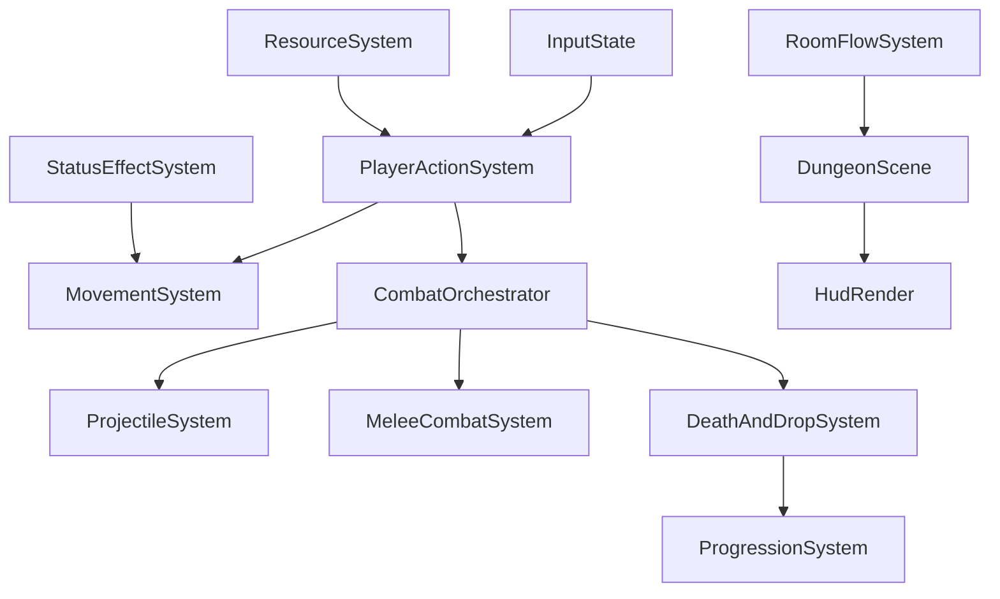

# Plano detalhado: Refactor first + features

## Objetivo

Preparar a arquitetura para receber as novas mecânicas sem inflar responsabilidades de `[/home/danten/Documents/G_v2/mion_engine_cpp/src/scenes/dungeon_scene.hpp](/home/danten/Documents/G_v2/mion_engine_cpp/src/scenes/dungeon_scene.hpp)` e `[/home/danten/Documents/G_v2/mion_engine_cpp/src/entities/actor.hpp](/home/danten/Documents/G_v2/mion_engine_cpp/src/entities/actor.hpp)`, mantendo o jogo estável a cada passo.

## Decisões arquiteturais (resolvidas antes da implementação)

| Risco                                   | Decisão                                                                                                 |
| --------------------------------------- | ------------------------------------------------------------------------------------------------------- |
| Ponteiros `_actors` inválidos mid-frame | Pools separados: `_projectiles` e `_ground_items` fora de `_actors`; `_enemies.reserve()` fixo no reset |
| Ordem das features causava retrabalho   | Sequência: **Dash → Stamina → Ranged** (stamina gata o dash desde o início)                             |
| HUD sem tarefa explícita                | `_render_hud()` método privado criado na Fase 0.3 (HP, Stamina, XP/Level)                               |
| Precisão da janela de Parry             | Float segundos (`parry_window_duration_seconds ≈ 0.12f`, ~7 frames a 60hz), no startup do inimigo       |

---

## Diagnóstico técnico (estado atual)

- `DungeonScene` concentra input, movimento, combate, IA, audio e render.
- `Actor` concentra muito estado (transform, combate, vida, IA/pathing).
- Combate melee está bem definido em `[/home/danten/Documents/G_v2/mion_engine_cpp/src/systems/melee_combat.hpp](/home/danten/Documents/G_v2/mion_engine_cpp/src/systems/melee_combat.hpp)`, mas ainda acoplado à cena.
- Estrutura de progressão (drops/xp/level/transição de salas) ainda não está consolidada no runtime.

## Arquitetura-alvo (incremental, sem rewrite)

## Fase 0 - Refatoração de preparo (antes das features)

### 0.1 Definir fronteiras de sistemas

**Criar/organizar módulos (mínimos):**

- `[/home/danten/Documents/G_v2/mion_engine_cpp/src/systems/player_action.hpp](/home/danten/Documents/G_v2/mion_engine_cpp/src/systems/player_action.hpp)`
- `[/home/danten/Documents/G_v2/mion_engine_cpp/src/systems/movement_system.hpp](/home/danten/Documents/G_v2/mion_engine_cpp/src/systems/movement_system.hpp)`
- `[/home/danten/Documents/G_v2/mion_engine_cpp/src/systems/resource_system.hpp](/home/danten/Documents/G_v2/mion_engine_cpp/src/systems/resource_system.hpp)`
- `[/home/danten/Documents/G_v2/mion_engine_cpp/src/systems/status_effect_system.hpp](/home/danten/Documents/G_v2/mion_engine_cpp/src/systems/status_effect_system.hpp)`
- `[/home/danten/Documents/G_v2/mion_engine_cpp/src/systems/room_flow_system.hpp](/home/danten/Documents/G_v2/mion_engine_cpp/src/systems/room_flow_system.hpp)`

**Meta:** `DungeonScene` passa a orquestrar chamadas, não implementar todas as regras.

### 0.2 Quebrar estado de Actor em blocos lógicos

**Adicionar componentes de estado (simples):**

- `[/home/danten/Documents/G_v2/mion_engine_cpp/src/components/stamina.hpp](/home/danten/Documents/G_v2/mion_engine_cpp/src/components/stamina.hpp)`
- `[/home/danten/Documents/G_v2/mion_engine_cpp/src/components/status_effect.hpp](/home/danten/Documents/G_v2/mion_engine_cpp/src/components/status_effect.hpp)`
- `[/home/danten/Documents/G_v2/mion_engine_cpp/src/components/progression.hpp](/home/danten/Documents/G_v2/mion_engine_cpp/src/components/progression.hpp)`

**Ajustar `Actor`:** apenas referências/estado agregado; evitar novos campos ad-hoc.

### 0.3 Normalizar ordem do fixed update + HUD

Aplicar pipeline único em `[/home/danten/Documents/G_v2/mion_engine_cpp/src/scenes/dungeon_scene.hpp](/home/danten/Documents/G_v2/mion_engine_cpp/src/scenes/dungeon_scene.hpp)`:

1. input intents
2. resources/status tick (stamina regen, status tick)
3. movement/knockback
4. melee/projectile resolve
5. deaths → drops/xp
6. room transition
7. `_render_hud()` — método privado isolado (HP, Stamina, XP/Level)

**Pools de entidades dinâmicas (decisão arquitetural):**

- `_actors` → só player + enemies; `_enemies.reserve(max)` no `_reset_all()` → ponteiros estáveis
- `_projectiles` → `std::vector<Projectile>` gerenciado pelo `ProjectileSystem`
- `_ground_items` → `std::vector<GroundItem>` gerenciado pelo `DropSystem`

### 0.4 Critérios de aceite da Fase 0

- Gameplay atual preservado (sem regressões visíveis).
- `DungeonScene` com blocos claros e menor acoplamento.
- Extensões para dash/projétil/stamina plugáveis sem mudanças estruturais grandes.

---

## Fase 1 - Combate base

### 1) Dash / Roll

**Implementação:**

- Estado de dash + timers/cooldown no player (via `Actor` + componente de stamina).
- I-frame temporário durante roll (reusar `impact_invulnerability_remaining` de `CombatState`).
- Integrar com facing/knockback já existente.

**Arquivos foco:**

- `[/home/danten/Documents/G_v2/mion_engine_cpp/src/entities/actor.hpp](/home/danten/Documents/G_v2/mion_engine_cpp/src/entities/actor.hpp)`
- `[/home/danten/Documents/G_v2/mion_engine_cpp/src/components/combat.hpp](/home/danten/Documents/G_v2/mion_engine_cpp/src/components/combat.hpp)`
- `[/home/danten/Documents/G_v2/mion_engine_cpp/src/systems/movement_system.hpp](/home/danten/Documents/G_v2/mion_engine_cpp/src/systems/movement_system.hpp)`
- `[/home/danten/Documents/G_v2/mion_engine_cpp/src/scenes/dungeon_scene.hpp](/home/danten/Documents/G_v2/mion_engine_cpp/src/scenes/dungeon_scene.hpp)`

**Aceite:** dash consistente, invulnerabilidade válida no intervalo e colisão respeitada.

### 2) Stamina

> **Nota:** antes de Ranged — stamina gata o dash desde o início, evita retrabalho em `movement_system`.

**Implementação:**

- `StaminaState` com `current`, `max`, `regen_rate`, `regen_delay_remaining`.
- Custo no dash; bloqueio quando insuficiente.
- Regen com atraso curto após consumo.
- `_render_hud()` inclui barra de stamina.

**Arquivos foco:**

- `[/home/danten/Documents/G_v2/mion_engine_cpp/src/components/stamina.hpp](/home/danten/Documents/G_v2/mion_engine_cpp/src/components/stamina.hpp)`
- `[/home/danten/Documents/G_v2/mion_engine_cpp/src/systems/resource_system.hpp](/home/danten/Documents/G_v2/mion_engine_cpp/src/systems/resource_system.hpp)`
- `[/home/danten/Documents/G_v2/mion_engine_cpp/src/scenes/dungeon_scene.hpp](/home/danten/Documents/G_v2/mion_engine_cpp/src/scenes/dungeon_scene.hpp)`

**Aceite:** anti-spam de dash funcional, regen previsível, HUD legível.

### 3) Ataque ranged (botão dedicado)

**Implementação:**

- Entidade `Projectile` com `position`, `velocity`, `lifetime`, `damage`, `owner_team`.
- Pool próprio `_projectiles` em `DungeonScene` — **não entra em `_actors`**.
- Spawn por botão dedicado; consome stamina; melee permanece intacto.
- Colisão projectile × hurtbox e descarte por hit/timeout.

**Arquivos foco:**

- `[/home/danten/Documents/G_v2/mion_engine_cpp/src/entities/projectile.hpp](/home/danten/Documents/G_v2/mion_engine_cpp/src/entities/projectile.hpp)`
- `[/home/danten/Documents/G_v2/mion_engine_cpp/src/systems/projectile_system.hpp](/home/danten/Documents/G_v2/mion_engine_cpp/src/systems/projectile_system.hpp)`
- `[/home/danten/Documents/G_v2/mion_engine_cpp/src/core/input.cpp](/home/danten/Documents/G_v2/mion_engine_cpp/src/core/input.cpp)`
- `[/home/danten/Documents/G_v2/mion_engine_cpp/src/scenes/dungeon_scene.hpp](/home/danten/Documents/G_v2/mion_engine_cpp/src/scenes/dungeon_scene.hpp)`

**Aceite:** melee+ranged coexistem; projétil danifica uma vez, expira, consome stamina corretamente.

---

## Fase 2 - Progressão de dungeon

### 4) Múltiplas salas / transição

- Introduzir portas/zonas de transição por `RoomDefinition`.
- Fluxo de sala atual -> próxima sala via `next_scene`/controle de room index.
- Wave scaling por nível da sala.

**Arquivos foco:**

- `[/home/danten/Documents/G_v2/mion_engine_cpp/src/world/room.hpp](/home/danten/Documents/G_v2/mion_engine_cpp/src/world/room.hpp)`
- `[/home/danten/Documents/G_v2/mion_engine_cpp/src/systems/room_flow_system.hpp](/home/danten/Documents/G_v2/mion_engine_cpp/src/systems/room_flow_system.hpp)`
- `[/home/danten/Documents/G_v2/mion_engine_cpp/src/scenes/dungeon_scene.hpp](/home/danten/Documents/G_v2/mion_engine_cpp/src/scenes/dungeon_scene.hpp)`

### 5) Drops no chão

- `GroundItem` com tipo (`Health`, `Damage`, `Speed`) e posição.
- Drop em morte de inimigo (chance/tabela simples por tipo).
- Pickup por proximidade.

**Arquivos foco:**

- `[/home/danten/Documents/G_v2/mion_engine_cpp/src/entities/ground_item.hpp](/home/danten/Documents/G_v2/mion_engine_cpp/src/entities/ground_item.hpp)`
- `[/home/danten/Documents/G_v2/mion_engine_cpp/src/systems/drop_system.hpp](/home/danten/Documents/G_v2/mion_engine_cpp/src/systems/drop_system.hpp)`
- `[/home/danten/Documents/G_v2/mion_engine_cpp/src/scenes/dungeon_scene.hpp](/home/danten/Documents/G_v2/mion_engine_cpp/src/scenes/dungeon_scene.hpp)`

### 6) XP + level up

- XP por kill + curva de level.
- Ao subir de nível: escolha de upgrade simples.
- HUD mínima de XP/Level.

**Arquivos foco:**

- `[/home/danten/Documents/G_v2/mion_engine_cpp/src/components/progression.hpp](/home/danten/Documents/G_v2/mion_engine_cpp/src/components/progression.hpp)`
- `[/home/danten/Documents/G_v2/mion_engine_cpp/src/systems/progression_system.hpp](/home/danten/Documents/G_v2/mion_engine_cpp/src/systems/progression_system.hpp)`
- `[/home/danten/Documents/G_v2/mion_engine_cpp/src/scenes/dungeon_scene.hpp](/home/danten/Documents/G_v2/mion_engine_cpp/src/scenes/dungeon_scene.hpp)`

---

## Fase 3 - Profundidade de combate

### 7) Parry / Block

- Input defensivo + janela curta de parry (`parry_window_duration_seconds ≈ 0.12f`, ~7 frames a 60hz).
- Janela ativa durante o **startup do ataque inimigo** (o "tell" visível).
- Implementado via float segundos em `CombatState` — consistente com o padrão existente.
- Parry bem-sucedido aplica stun no inimigo.

### 8) Status effects

- `StatusEffectType`: `Poison`, `Slow`, `Stun`.
- Tick/duração/regras de aplicação e expiração.
- Ghost aplica `Slow`; Skeleton upgrade para `Poison`.

### 9) Ataque especial / combo

- Contador de hits consecutivos.
- 3º hit aplica efeito forte (knockback pesado ou AoE).
- Integrar com stamina para não virar spam.

**Arquivos foco da fase:**

- `[/home/danten/Documents/G_v2/mion_engine_cpp/src/components/combat.hpp](/home/danten/Documents/G_v2/mion_engine_cpp/src/components/combat.hpp)`
- `[/home/danten/Documents/G_v2/mion_engine_cpp/src/components/status_effect.hpp](/home/danten/Documents/G_v2/mion_engine_cpp/src/components/status_effect.hpp)`
- `[/home/danten/Documents/G_v2/mion_engine_cpp/src/systems/melee_combat.hpp](/home/danten/Documents/G_v2/mion_engine_cpp/src/systems/melee_combat.hpp)`
- `[/home/danten/Documents/G_v2/mion_engine_cpp/src/systems/status_effect_system.hpp](/home/danten/Documents/G_v2/mion_engine_cpp/src/systems/status_effect_system.hpp)`

---

## Ordem operacional

1. Fase 0 (fronteiras + pipeline de update + `_render_hud()` + stamina/status/progression stubs).
2. Feature 1 (Dash/Roll) + teste.
3. Feature 2 (Stamina integrada com dash) + teste.
4. Feature 3 (Ranged com pool separado) + teste de coexistência.
5. Regressão final da Fase 1.

## Testes de aceite por feature (checklist)

- Dash: i-frame correto, cooldown respeitado, sem atravessar parede.
- Ranged: projétil nasce na direção certa, aplica dano uma vez, expira.
- Stamina: ações bloqueadas sem recurso, regen previsível, HUD legível.
- Regressão: melee, IA básica, knockback e câmera continuam estáveis.

## Riscos e mitigação

- **Risco:** crescimento de dependências cruzadas em `DungeonScene`.
**Mitigação:** cena apenas orquestra, regra vai para sistemas.
- **Risco:** tuning quebrar feeling de combate.
**Mitigação:** parâmetros centralizados e ajustes curtos por playtest.
- **Risco:** ordem de update causar bugs intermitentes.
**Mitigação:** pipeline fixo documentado e aplicado em um único ponto.
- ~~**Risco:** ponteiros em `_actors` invalidados por entidades dinâmicas mid-frame.~~ **Resolvido:** pools separados para `_projectiles` e `_ground_items`; `_enemies.reserve()` fixo.
- ~~**Risco:** retrabalho em `movement_system` por stamina implementada depois do dash.~~ **Resolvido:** ordem trocada para Dash → Stamina → Ranged.
- ~~**Risco:** HUD de stamina crescendo inline em `render()`.~~ **Resolvido:** `_render_hud()` criado na Fase 0.3.
- ~~**Risco:** imprecisão na janela de parry.~~ **Resolvido:** float segundos (`≈ 0.12f`), no startup do inimigo.

