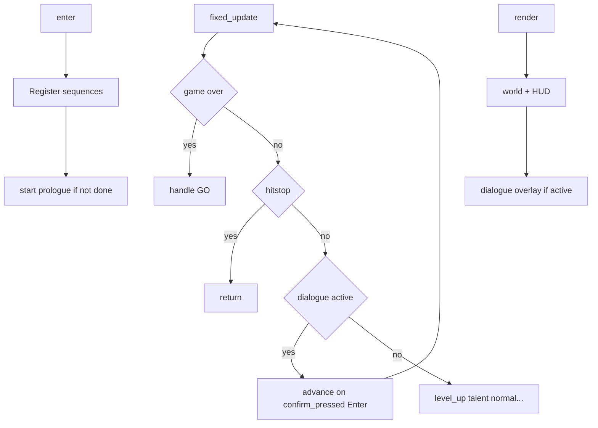

# Plano: diálogo, save/load e stats em dados

Ordem recomendada (igual ao [ROADMAP.md](ROADMAP.md)): **diálogo → save → dados**. Cada fase é entregável e testável sozinha; save e INI tocam `[dungeon_scene.hpp](src/scenes/dungeon_scene.hpp)` — convém merge cuidadoso ou fazer save após diálogo estável.

---

## Fase 1 — Diálogo / narrativa

**Objetivo:** sequência de 3 linhas ao entrar na dungeon; player parado até terminar com **Enter** como confirmação (ver input abaixo).

**Input — tecla de confirmação separada do ataque:** `[InputState](src/core/input.hpp)` hoje só expõe `attack_pressed` (Space/Z). Usar esse campo para avançar diálogo faria o primeiro frame pós-diálogo disparar ataque. **Implementar `confirm_pressed`** mapeado a **Enter** (`SDL_SCANCODE_RETURN` em `[input.cpp](src/core/input.cpp)`), com detecção por **borda** (igual aos outros botões). O diálogo avança **somente** com `confirm_pressed`; Space/Z permanecem ataque. Game over continua usando `attack_pressed` — correto porque o player não está vivo. `InputState{}` nos testes permanece válido (`confirm_pressed` default `false`). Quando existir `ScriptedInputSource`, deve expor `confirm_pressed` também.

**Arquivos novos (header-only, padrão do projeto):**

- `[src/core/dialogue.hpp](src/core/dialogue.hpp)` — tipos: `DialogueLine` (`speaker`, `text`, `SDL_Color portrait_color`), `DialogueSequence` (`id`, `vector<DialogueLine>`), registro `unordered_map<string, DialogueSequence>` ou vetor + lookup.
- `[src/systems/dialogue_system.hpp](src/systems/dialogue_system.hpp)` — estado: sequência ativa, índice de linha, `is_active`, opcional `on_finish` (std::function ou callback por id). API: `start(id)`, `advance()`, `fixed_update(input)` (edge só em `**confirm_pressed`**, nunca `attack_pressed`), `render(r, viewport_w, viewport_h)` usando `[draw_text](src/core/bitmap_font.hpp)` + helper de **word wrap** (novo util pequeno no mesmo header ou em `dialogue_system`).

**Integração em `[DungeonScene](src/scenes/dungeon_scene.hpp)`:**

- Membro `DialogueSystem _dialogue`.
- Em `enter()`, após setup atual: registrar sequência `dungeon_prologue` (3 linhas) e chamar `start` **uma vez** (flag `bool _prologue_played` persistida só na sessão; com save na Fase 2 pode passar a depender do save).
- **Ordem no `fixed_update`:** após limpar `_pending_next_scene`, manter **game over** e **hitstop** como hoje; em seguida, se `_dialogue.is_active()`, processar avanço com **edge de `confirm_pressed`** e `return` (sem `_player_action` nem movimento). Só depois vêm **level-up** e **talentos** e o restante da lógica.
- Em `render`, após o mundo e antes ou depois do HUD existente: se ativo, desenhar faixa inferior (retângulo preto semi-opaco), nome do speaker na cor, texto com wrap, indicador `>` com toggle por timer (`SDL_GetTicks`).

**Extensão futura (fora do critério mínimo):** gatilhos em coleta de item, mini-boss, próxima sala — deixar `start(id)` público e pontos de chamada documentados.

---

## Fase 2 — Save / load

**Objetivo:** fechar e reabrir o jogo mantendo nível, talentos, sala e HP (e o que mais for necessário para o estado não “quebrar”).

**Arquivo novo:** `[src/core/save_system.hpp](src/core/save_system.hpp)`

- Struct `SaveData` espelhando o roadmap: `version`, campos de `[ProgressionState](src/components/progression.hpp)` relevantes (`xp`, `level`, `xp_to_next`, `pending_level_ups`, bônus de upgrade, `spell_damage_multiplier`), bitfield ou `talent_i=0/1` para `[TalentState](src/components/talent_state.hpp)`, `spell_i` para `[SpellBookState::unlocked](src/components/spell_book.hpp)` (cooldowns zerados ao load), `room_index`, `player_hp`. **Recomendado:** incluir `mana.current`, `mana.max`, `mana.regen_rate` (e talvez `regen_delay_remaining`) para não divergir dos talentos já aplicados; stamina opcional.
- Funções estáticas ou classe `SaveSystem`: `save(path, SaveData)`, `load(path, SaveData&)`, `exists(path)`; formato **linha a linha `key=value`**, sem libs.

**Caminho do arquivo:** ex. `SDL_GetPrefPath("mion", "mion_engine")` + `save.txt`, ou path fixo documentado — evitar depender do CWD.

`**[DungeonScene](src/scenes/dungeon_scene.hpp)`:**

- Substituir ou ramificar `[_full_run_reset_initial()](src/scenes/dungeon_scene.hpp)`: se `SaveSystem::exists` e política “carregar” (MVP: **sempre carregar** se existir, ou botão no title — ver nota abaixo), preencher `_player.progression`, `_player.talents`, `_player.spell_book`, `_room_index`, HP; depois `_build_room` / `_load_room_visuals` / nav / `_configure_player_state(false)` ajustando HP salvo; **não** zerar progressão antes do load.
- Novo helper `_apply_save_data(const SaveData&)` e `_build_save_data() -> SaveData` (serialização simétrica).
- **Auto-save** em `[_advance_room()](src/scenes/dungeon_scene.hpp)` após avançar índice e reconstruir sala.
- **Auto-save** ao definir `_pending_next_scene` para `"title"` (após `scene_exit_to` da porta), antes da troca ser consumida pelo `[main](src/main.cpp)`.

**Title / nova run:** em `[title_scene.hpp](src/scenes/title_scene.hpp)` ou `enter()` da dungeon: opção simples — tecla para “nova run” que apaga save (`remove`) ou incrementa `slot`; MVP pode ser **um único save** + apagar ao game over restart completo se desejado (alinhar com design).

**Testes:** em `[tests/test_main.cpp](tests/test_main.cpp)`, casos que escrevem string em memória ou arquivo temporário: round-trip `SaveData` e rejeição de `version` desconhecida.

**Nota de produto:** o roadmap cita “pergunta ou carrega direto”. Para cortar escopo: carregar automaticamente no primeiro `enter()` da dungeon se `exists`; menu de confirmação pode ser Fase 2.1.

---

## Fase 3 — Stats em dados (INI)

**Objetivo:** alterar `data/enemies.ini` (etc.) sem recompilar; fallback para valores atuais de `[get_enemy_def](src/entities/enemy_type.hpp)` / `[spell_def](src/components/spell_defs.hpp)`.

**Arquivo novo:** `[src/core/ini_loader.hpp](src/core/ini_loader.hpp)` — parser mínimo: linhas `[section]`, `key=value`, trim, ignorar vazios/`#`; resultado `unordered_map<string, unordered_map<string, string>>` ou struct com `get_int`, `get_float`.

**Dados:** `[data/enemies.ini](data/enemies.ini)`, `[data/spells.ini](data/spells.ini)`, `[data/items.ini](data/items.ini)` — exemplos espelhando valores atuais (Skeleton/Orc/Ghost; Bolt/Nova; chance de drop / raio de pickup / bônus de cada `[GroundItemType](src/entities/ground_item.hpp)`).

**Refatoração necessária:**

- **Inimigos:** manter `EnemyDef` completo em código (collision, sprites, timings). Em `DungeonScene::enter()` (ou função `_load_data_tables()` chamada uma vez), carregar INI e **sobrescrever só campos numéricos** (`max_hp`, `move_speed`, `aggro_range`, `attack_range`, `stop_range`, `damage`, `knockback_friction`, opcionalmente `startup_sec` / `active_sec` / `recovery_sec`) em um `std::array<EnemyDef, 3>` ou cópia por tipo antes de `[_spawn_enemy](src/scenes/dungeon_scene.hpp)`.
- **Magias:** hoje `[spell_defs.hpp](src/components/spell_defs.hpp)` usa função `inline const SpellDef& spell_def(SpellId)` com **array `static const` local** dentro da função (não é `constexpr`). Para INI, substituir por **armazenamento mutável** (ex. `std::array<SpellDef, kSpellCount>` em escopo de tradução unit + `init_spell_defs_from_defaults()` e merge do INI). A função pode continuar retornando `const SpellDef&` para os valores atuais — o que muda é a **vida útil e a fonte dos dados**: após a refatoração, **revisar todos os call sites** de `spell_def` (grep). Nada deve guardar referência/ponteiro para além do frame se no futuro houver reload; no MVP, init uma vez no `enter()` da dungeon basta.
- **Itens:** `[DropSystem](src/systems/drop_system.hpp)` passa a ler constantes de uma struct `DropItemConfig` preenchida no `enter()` da dungeon (ou singleton carregado uma vez).

**Resolução de paths:** reutilizar padrão já usado com `assets/` (ex. base path relativo ao executável ou `std::filesystem::current_path()`); se arquivo ausente, não logar como erro fatal — usar defaults.

**Teste:** unitário do parser INI + um teste que carrega `enemies.ini` de string e verifica um valor.

---

## Riscos e ordem de merge

| Risco                                      | Mitigação                                                                                                                                        |
| ------------------------------------------ | ------------------------------------------------------------------------------------------------------------------------------------------------ |
| `fixed_update` já tem vários early-returns | Gate de diálogo **após hitstop**, **antes** de level-up/talentos; não colocar antes de hitstop. Manter `clear` de `_pending_next_scene` no topo. |
| Save + reset                               | Separar “nova run” de “continue”; `_full_run_reset_initial` só zera tudo quando for nova run explícita.                                          |
| `spell_def` — `static const` local         | Fase 3: tabela mutável + init; **grep** em todo o projeto; cuidado com código que assume imutabilidade ou cacheia endereços.                     |

**Estimativa de esforço relativa:** Fase 1 média; Fase 2 média (edge cases HP vs max_hp após load); Fase 3 **média-alta a alta** — refator de `spell_def` (storage + init) e revisão de call sites, além de spawn/INI de inimigos.

Nenhuma alteração obrigatória ao [CMakeLists.txt](CMakeLists.txt) se novos módulos forem só `.hpp` incluídos por cenas existentes; arquivos em `data/` podem ser copiados para o build com `configure_file` ou documentados como leitura do diretório fonte.